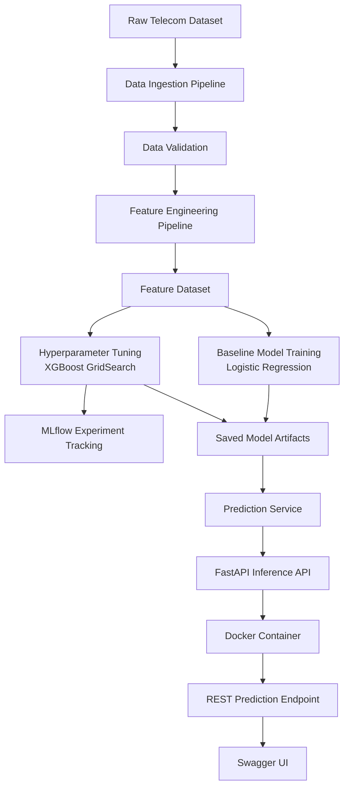

# Customer Churn Prediction Platform

Production-style machine learning platform for predicting telecom customer churn.
This project demonstrates how to build a  **complete ML system** , not just a model — including data pipelines, experiment tracking, API inference, and containerized deployment.

---

# Overview

Customer churn prediction is a common business problem in subscription industries.
This platform simulates a real production ML workflow by implementing:

* Data ingestion pipeline
* Feature engineering pipeline
* Model training and evaluation
* Hyperparameter tuning
* Experiment tracking with MLflow
* FastAPI inference API
* Dockerized deployment

The project emphasizes **ML engineering practices** such as modular architecture, reproducibility, and deployable services.

---

# Architecture

```
           Raw Dataset
                │
                ▼
        Ingestion Pipeline
                │
                ▼
       Feature Engineering
                │
                ▼
        Feature Dataset
                │
                ▼
      Model Training Pipeline
                │
                ▼
      Hyperparameter Tuning
           (MLflow)
                │
                ▼
          Saved Model
                │
                ▼
           FastAPI API
                │
                ▼
        Docker Container
                │
                ▼
           REST Endpoint
```

---

# System Architecture




# Tech Stack

| Category            | Tools                 |
| ------------------- | --------------------- |
| Language            | Python                |
| Data Processing     | Pandas                |
| Machine Learning    | Scikit-learn, XGBoost |
| Experiment Tracking | MLflow                |
| API                 | FastAPI               |
| Containerization    | Docker                |
| Testing             | PyTest                |

---

# Project Structure

```
customer-churn-platform
│
├── api
│   ├── main.py
│   └── schemas.py
│
├── src
│   ├── ingestion
│   │   ├── load_data.py
│   │   ├── run_ingestion.py
│   │   └── validate_data.py
│   │
│   ├── features
│   │   └── build_features.py
│   │
│   ├── training
│   │   ├── train.py
│   │   ├── evaluate.py
│   │   └── tune.py
│   │
│   ├── serving
│   │   └── predict.py
│   │
│   ├── registry
│   │   └── mlflow_registry.py
│   │
│   └── utils
│
├── configs
│   ├── paths.yaml
│   └── training.yaml
│
├── artifacts
│   ├── models
│   ├── reports
│   └── figures
│
├── tests
│
├── Dockerfile
├── docker-compose.yml
├── requirements.txt
└── README.md
```

---

# Running the Project

## Option 1 — Run Locally

Install dependencies:

```
pip install -r requirements.txt
```

Run the training pipeline:

```
python -m src.training.train
```

Start the API:

```
uvicorn api.main:app --reload
```

Open the interactive API documentation:

```
http://localhost:8000/docs
```

---

# Option 2 — Run with Docker (Recommended)

Build the container:

```
docker compose build
```

Start the service:

```
docker compose up
```

Open the API documentation:

```
http://localhost:8000/docs
```

---

# Example API Request

Endpoint:

```
POST /predict
```

Request body:

```
{
  "features": {
    "tenure": 12.0,
    "MonthlyCharges": 70.35,
    "TotalCharges": 844.2,
    "SeniorCitizen": 0.0
  }
}
```

Response:

```
{
  "prediction": 1,
  "prediction_label": "Yes",
  "churn_probability": 0.61
}
```

---

# Model Development

### Baseline Model

Logistic Regression

### Advanced Model

XGBoost with GridSearchCV hyperparameter tuning

### Experiment Tracking

MLflow records:

* model parameters
* evaluation metrics
* best model runs

Artifacts are saved in:

```
artifacts/models/
artifacts/reports/
```

---

# Testing

Run unit tests with:

```
pytest
```

Tests validate:

* ingestion pipeline
* feature engineering
* model training
* evaluation logic

---

# Future Improvements

Potential extensions to this system:

* Feature pipeline serialization
* Raw feature ingestion for API
* Model registry integration
* CI/CD automation
* Cloud deployment
* Monitoring and drift detection

---

# Author

Darrell Mortalla
AI / Machine Learning Engineering Portfolio

GitHub
[https://github.com/dmortalla](https://github.com/dmortalla)

---
